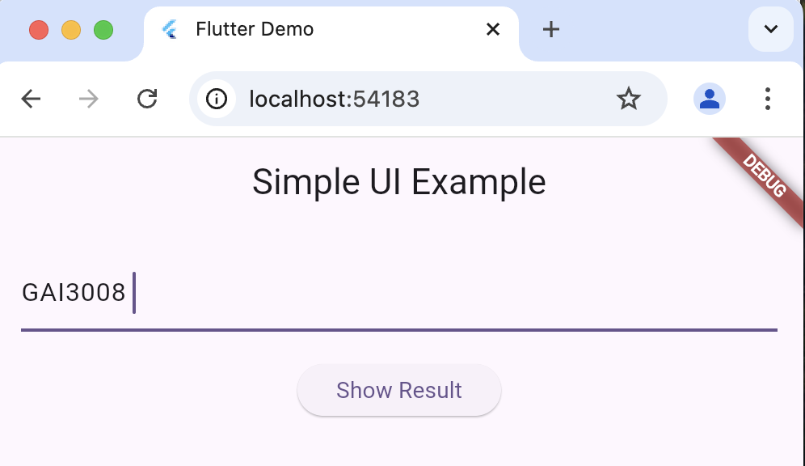

# gai3008_2024_ex6_1

A new Flutter project.

## Getting Started

This project is a starting point for a Flutter application.

A few resources to get you started if this is your first Flutter project:

- [Lab: Write your first Flutter app](https://docs.flutter.dev/get-started/codelab)
- [Cookbook: Useful Flutter samples](https://docs.flutter.dev/cookbook)

For help getting started with Flutter development, view the
[online documentation](https://docs.flutter.dev/), which offers tutorials,
samples, guidance on mobile development, and a full API reference.


---
1. 플러터 프로젝트 시작하기 

```sh
flutter create gai3008_2024_ex6_1
cd gai3008_2024_ex6_1
flutter run 
```
---

2. UI 구현: TextField, Button, Text (25분)


---
2. UI 구현: TextField, Button, Text (25분)


---